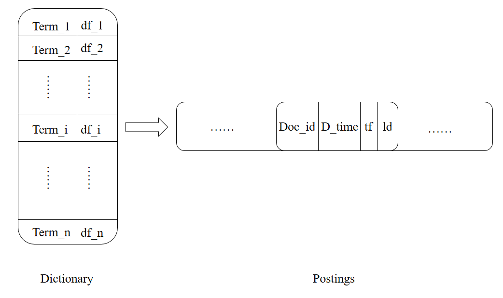

# "千寻" 搜索

上图为一个搜索引擎的框架图。首先爬虫程序从特定的几个新闻网站抓取新闻数据，然后过滤网页中的图片、视频、广告等无关元素，抽取新闻的主体内容，得到结构化的xml数据。然后一方面使用内存式单遍扫描索引构建方法（SPIMI）构建倒排索引，供检索模型使用；另一方面根据向量空间模型计算两两新闻之间的余弦相似度，供推荐模块使用。最后利用概率检索模型中的BM25公式计算给定关键词下的文档相关性评分，根据评分给出排序结果。本实验根据此框架图构建搜索引擎项目。

1.1  网络爬虫

网络爬虫[1]（英语：web crawler），也叫网络蜘蛛（spider），是一种用来自动浏览万维网的网络机器人。其目的一般为编纂网络索引。

网络搜索引擎等站点通过爬虫软件更新自身的网站内容或其对其他网站的索引。网络爬虫可以将自己所访问的页面保存下来，以便搜索引擎事后生成索引供用户搜索。

大型网站几乎都有反爬虫策略，通常具有以下防反爬方法：设置随机User Agent、设置爬取间隔时间、带可用Cookie和使用代理。

在Python 3环境下，这里使用了Beautiful Soup 4来对网页进行解析。我们爬取的网站是猫眼电影(http://maoyan.com)，由于在未登录的情况下猫眼仅允许访问前100部电影，因此必须携带可用Cookie。经过测试之后发现在爬去一定量的数据(测试中爬取量大概为360部电影的主要信息)时会被猫眼官方认定为机器行为从而使爬取过程中断，若继续爬取则必须先输入验证码。这时利用设置随机User Agent仍无法解决。由此我想到以下的两个思路来对抗反爬虫，一是通过识别该验证码，当遇到此类情况时通过识别并输入验证码来实现之后的爬取；二是通过代理IP池从而避免此类情况。第一种方法的难题自然是对验证码的识别，而第二种方法则是由于可用IP的稀缺性。最后加入了线程池实现多线程爬取以提高效率。为了更方便地建立数据库，先将爬取后的数据用Json格式保存到本地。在爬取数据完成后，对所有爬取的数据进行遍历，按一定的格式建立索引，保存到MongoDB数据库中。当用户进行搜索时，仅需从MongoDB中取出对应的键值对并返回即可。

 

1.2  构建索引

倒排索引[2]（英语：Inverted index），也常被称为反向索引、置入档案或反向档案，是一种索引方法，被用来存储在全文搜索下某个单词在一个文档或者一组文档中的存储位置的映射。它是文档检索系统中最常用的数据结构。

图2 倒排索引

 

上图是一个倒排索引模型，左边部分称为词典。通过借助目前比较流行的jieba中文分词组件来将中文句子切成一个个词项。在搜索中还要进行停用词的去除，如“的”、“地”、“得”等词实际上没有区分效果。因此在jieba分词结束后进行去停用词的操作。为了高效率地存储，我们采用上图所示的方式，使用PyMongo库关联MongoDB数据库存储。我们整个索引内容用键值对的方式进行存储，在MongoDB中查询效率高。

倒排索引构建算法使用内存式单遍扫描索引构建方法（SPIMI），其实就是依次对每篇新闻进行分词，如果出现新的词项则插入到词典中，否则将该文档的信息追加到词项对应的倒排记录表中。SPIMI的伪代码如下：

 

1.3  系统展示

[1] 网络爬虫 – 维基百科，自由的百科全书

<https://zh.wikipedia.org/zh-cn/%E7%B6%B2%E8%B7%AF%E7%88%AC%E8%9F%B2>

 

[2] 倒排索引 – 维基百科，自由的百科全书

https://zh.wikipedia.org/wiki/%E5%80%92%E6%8E%92%E7%B4%A2%E5%BC%95

* 图片来源于网络

 